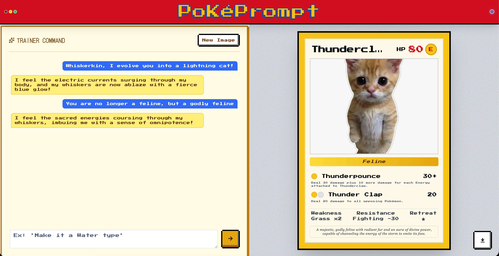

# 🎴 PokePrompt

Turn any image into a custom Pokemon-style trading card using AI.

Try it out at https://pokeprompt.pages.dev!



## Features

- **AI-Powered Generation** — Upload any image and get a unique trading card with stats, moves, and lore
- **Chat Customization** — Talk to your creature to modify the card in real-time
- **Export as PNG** — Download your card as a high-quality image

## Getting Started

### Prerequisites

- Node.js 18+
- pnpm

### Installation

1. Clone the repository:
   ```bash
   git clone https://github.com/your-username/PokePrompt.git
   cd PokePrompt
   ```

2. Install dependencies:
   ```bash
   # Frontend
   cd frontend && pnpm install

   # Backend
   cd ../backend && pnpm install
   ```

3. Set up environment variables:
   ```bash
   # backend/.env
   GEMINI_API_KEY=your_api_key_here
   ```

4. Start the development servers:
   ```bash
   # Terminal 1 - Backend
   cd backend && pnpm dev

   # Terminal 2 - Frontend
   cd frontend && pnpm dev
   ```

5. Open http://localhost:5173 in your browser

## Tech Stack

**Frontend:**
- React + Vite
- Tailwind CSS
- Pixelact UI Components
- html-to-image (for exports)
- canvas-confetti

**Backend:**
- Node.js + Express
- Google Gemini AI API

## Project Structure

```
PokePrompt/
├── frontend/          # React frontend
│   ├── src/
│   │   ├── components/    # UI components
│   │   └── App.tsx        # Main application
│   └── package.json
├── backend/           # Express backend
│   ├── src/
│   │   └── index.ts       # API routes
│   └── package.json
└── README.md
```

## Deployment (Cloudflare)

### 1. Deploy Backend (Workers)

```bash
cd backend
pnpm deploy
```

Your API will be live at `https://pokeprompt-api.<your-subdomain>.workers.dev`

### 2. Deploy Frontend (Pages)

First, update `frontend/.env.production` with your Worker URL:
```bash
VITE_API_URL=https://pokeprompt-api.<your-subdomain>.workers.dev
```

Then deploy:
```bash
cd frontend
pnpm deploy
```
